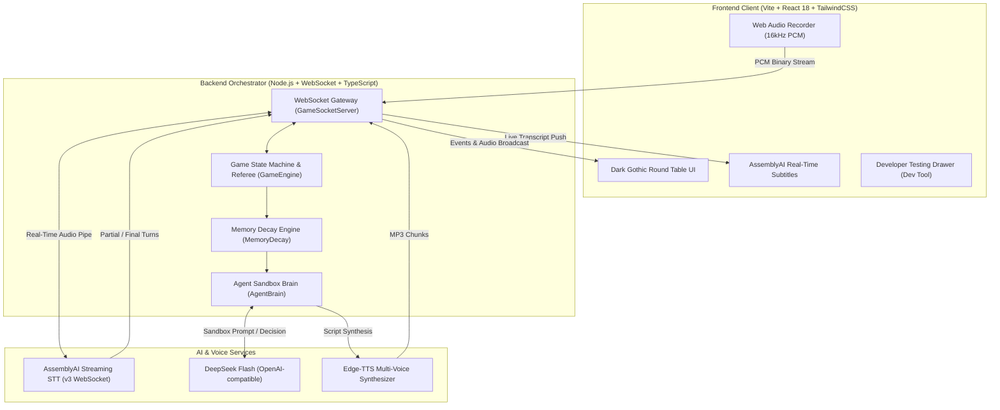

# 🐺 Voice Werewolf (全语音交互 AI 狼人杀)

> 🏆 Built for the **[AssemblyAI - Voice Agent Hackathon](https://lablab.ai/ai-hackathons/assemblyai-voice-agent-hackathon)**  
> An immersive, voice-first tabletop social deduction game featuring **1 Human Player + 5 Autonomous AI Agents**, powered by **AssemblyAI Universal-3.5 Pro Streaming (v3 WebSocket)** and **DeepSeek Flash**.

[](https://www.typescriptlang.org/)
[](https://www.assemblyai.com/)
[](https://www.deepseek.com/)
[](https://react.dev/)
[](https://tailwindcss.com/)
[](LICENSE)

[English Documentation](#english) | [中文说明文档](#chinese)

---

<a name="english"></a>
## 🌟 English Documentation

### 📖 Overview
**Voice Werewolf** brings the classic social deduction board game to life with cutting-edge real-time voice AI. Compete as the sole human player against **5 autonomous AI agents**, each with unique character traits, distinct neural voices, private memory banks, and cognitive limits:
- **🎙️ Real-Time Voice Streaming**: Speak naturally into your microphone. Audio is captured as 16kHz PCM and streamed directly to **AssemblyAI v3 Streaming WebSocket**, displaying typewriter-style real-time subtitles with sub-second latency.
- **🧠 Biomimetic Memory Decay Engine**: Overcomes LLM prompt overload by simulating real human forgetting. Older and minor events fade into abstract impressions or gut-feeling trust scores via an exponential decay formula.
- **⚡ DeepSeek Flash Autonomous Brain**: High-speed reasoning with strict sandbox prompt isolation (no god-view leaks). AI agents adaptively defend, claim roles, accuse suspects, and cast exile votes.
- **🎭 Multi-Voice Persona Matrix**: Unique neural TTS voices for the Moderator and all 5 AI characters, with silent LLM fast-forwarding when no human is part of night conspiracies.
- **🌐 Dual Language Support**: Select between **English** and **Simplified Chinese** before starting, locked throughout the game.

### 🏛️ System Architecture


### 🎮 Game Rules & 6-Player Setup
- **2 Werewolves**: Eliminate good players at night; blend in or claim divine roles by day.
- **1 Seer**: Check the true camp (Good / Werewolf) of one alive player each night.
- **1 Witch**: Possesses one single-use **Antidote** (saves the night victim) and one single-use **Poison** (kills one player). Mutually exclusive within the same night.
- **2 Villagers**: Uncover werewolves through daytime speeches, voting patterns, and logical contradictions.
- **Victory Conditions**:
  - Werewolves eliminated $\rightarrow$ **Good Camp Wins!**
  - Living Werewolves $\ge$ Living Good players $\rightarrow$ **Werewolf Camp Wins!**

### 🧮 Memory Decay Formula
Information fades over rounds using an exponential decay model:

$$M = (I_{base} \times R_{relevance}) \times e^{-\frac{\Delta r}{\tau \cdot P_{trait}}}$$

- $\Delta r$: Round distance from event occurrence to current round;
- $I_{base}$: Base salience ($3.0$ for claiming roles/checks, $2.0$ for accusations, $1.5$ for defenses, $0.5$ for passing);
- $R_{relevance}$: Self-mention multiplier ($2.0$ if the agent is named/attacked);
- $P_{trait}$: Cognitive memory retention coefficient (Arthur $1.3$, Leo $0.9$, etc.);
- $\tau$: Half-life constant ($2.0$);
- **3-Tier Memory Slices**:
  - **High Clarity ($M \ge 0.7$)**: Full verbatim quotes and exact reasoning.
  - **Medium Vague ($0.35 \le M < 0.7$)**: Blurs into emotional impression or abstract summary.
  - **Low Trust Score ($M < 0.35$)**: Verbatim forgotten; condensed into a $-5 \sim +5$ trust/suspicion score.

### 🚀 Quickstart Guide
1. **Clone and Install**:
   ```bash
   git clone https://github.com/SakuraCianna/Werewolf.git
   cd Werewolf
   npm install
   ```
2. **Configure API Keys**:
   ```bash
   cp server/.env.example server/.env
   ```
   Provide your credentials in `server/.env`:
   ```env
   # AssemblyAI Real-Time Streaming STT API Key, required
   ASSEMBLYAI_API_KEY=your_assemblyai_api_key_here

   # DeepSeek API Key, powers AI agent reasoning
   DEEPSEEK_API_KEY=your_deepseek_api_key_here
   ```
   *(Note: The system includes a complete Mock mode when keys are omitted, ensuring seamless zero-config exploration for judges!)*
3. **Run Both Client and Server**:
   ```bash
   npm run dev
   ```
   - Frontend UI: `http://localhost:5173`
   - Backend Server: `http://localhost:3001`

### 🧪 Automated Tests
Run full vitest suites across 23 test cases:
```bash
npm test
npm run build
```

---

<a name="chinese"></a>
## 📖 中文说明文档

### 🌟 项目特性
- **🎙️ AssemblyAI 实时流式同传**：真人玩家在发言阶段只需自然口述，AssemblyAI v3 WebSocket 毫秒级返回实时转写字幕，呈现打字机同传视觉动效；
- **🧠 仿生记忆衰退算法（Memory Decay Engine）**：结合近因效应、事件重要度（$I_{base}$）、自我关联度（$R_{relevance}$）与性格遗忘系数（$P_{trait}$）的指数衰退公式，生成高清晰、中模糊、低沉淀三层认知记忆切片；
- **⚡ DeepSeek Flash 极速决策大脑**：每个 AI 玩家拥有严格的沙盒信息隔离防作弊 Prompt，推理速度极快，在轮到发言时根据衰退后记忆自如完成站边、悍跳、辩护与投票；
- **🎭 独立角色声线矩阵**：法官与 5 位 AI 玩家均绑定独立声线，昼夜交替时具备夜间私密密谋与静默结算逻辑；
- **🌐 完整中英双语支持**：开局前一键选择【简体中文】或【English】，局内自动锁定；
- **🛠️ 开发者极速调试抽屉 (Dev Panel)**：页面右下角内置极速跳过、文字表水模拟与上帝视角透视工具。

### 📄 开源许可证 (License)
本项目基于 [MIT License](LICENSE) 开源发布。
欢迎提交 Issue 与 Pull Request，感谢 AssemblyAI 与 lablab.ai 举办的 Voice Agent Hackathon！
